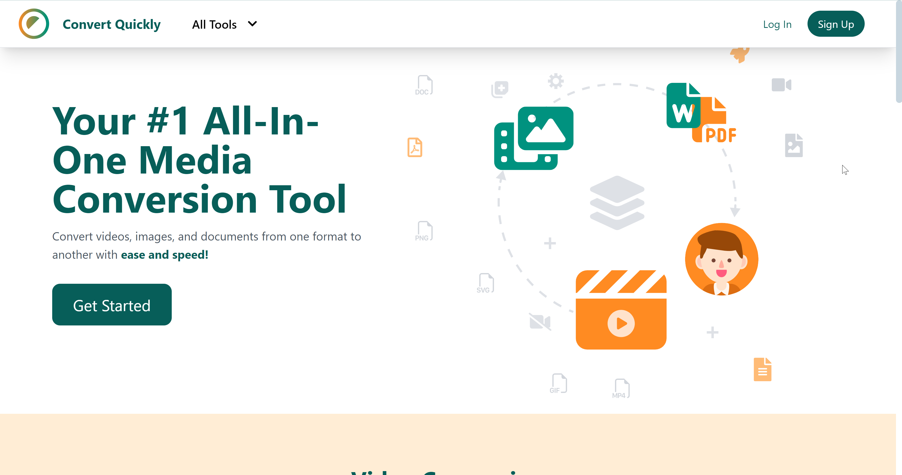
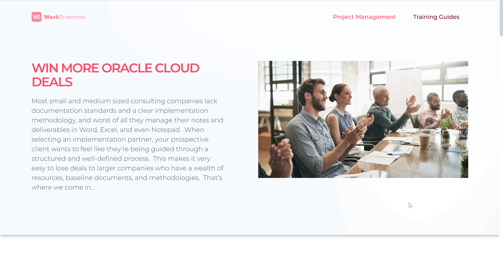
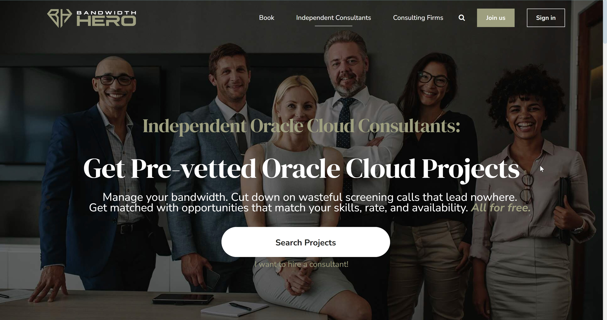

# Welcome to My Portfolio

## About Me
Software engineer with 4 years of full-stack web development experience specializing in JavaScript and TypeScript. I enjoy system architecting, designing, and implementing scalable web infrastructure.

## Projects
### Convert Quickly

- [Convert Quickly](https://convertquickly.com)
- Convert Quickly is a web application that allows users to upload media files, convert them to different formats, and download the converted files
- 

### Workstreamer

- [Workstreamer](https://workstreamer.com/)
- A cloud-based application that helps Oracle Cloud Consultants more effectively gather requirements, track open items, and capture client sign-off.  This allows you as the consultancy owner the ability to win more deals, reduce employee burnout through improved productivity, and ensure the highest level of confidence from every client.

### Bandwidth Hero

- [Bandwidth Hero](https://www.bandwidthhero.ai/)
- An online marketplace for Independent Oracle Consultants.
  
## Contact
Feel free to reach out to me at [danielajayi032@gmail.com](danielajayi032@gmail.com).
